# FDA  Submission

**Your Name:**
Shaswat Rajput

**Name of your Device:**

X-Ray Pneumonia Detection Tool (X-PDT)

## Algorithm Description 

### 1. General Information

**Intended Use Statement:** 

For assisting a radiologist in detection of pneumonia in x-ray images.

**Indications for Use:**

Screening of X-Ray Images.

Patient Population: 
* Both men and women
* Age: 2 to 90

X-Ray image properties:
* Body Part: Chest
* Position: AP (Anterior/Posterior) or PA (Posterior/Anterior)
* Modality: DX (Digital Radiography)

**Device Limitations:**

The model is recommended to be used without the following comorbid thoriac pathologies:
* Hernia
* Edema
* Effusion
* Consolidation

The reason for these is because X-Ray images containing four conditions
mentioned above have similar but significantly different distribution 
that that of Pneumonia X-Rays:

**Pneumonia:**

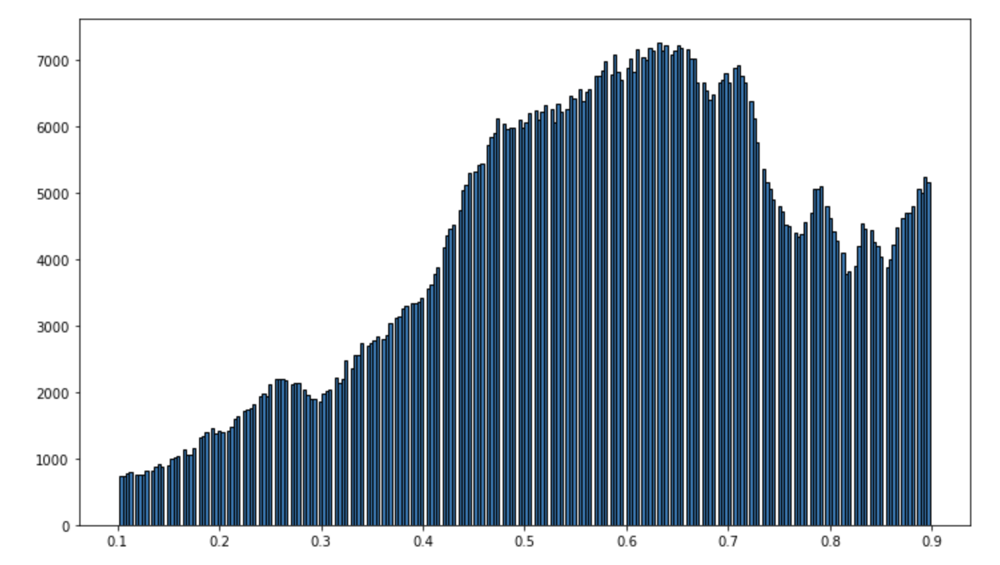

**Not recommended:**

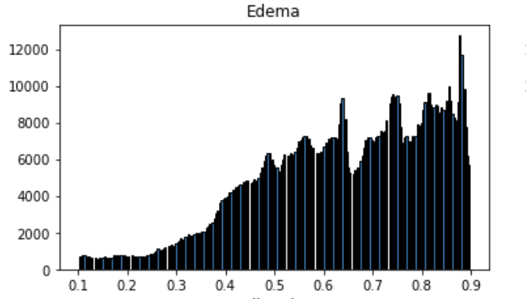
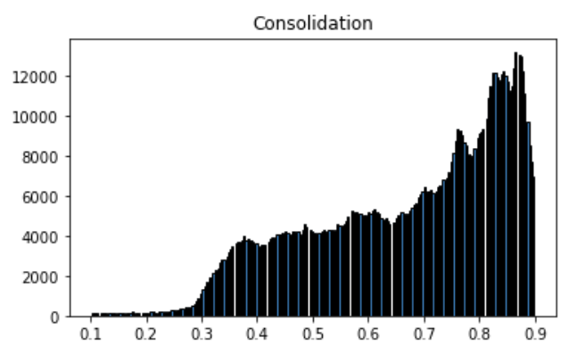
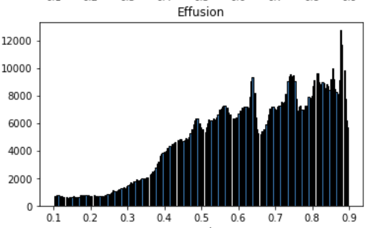
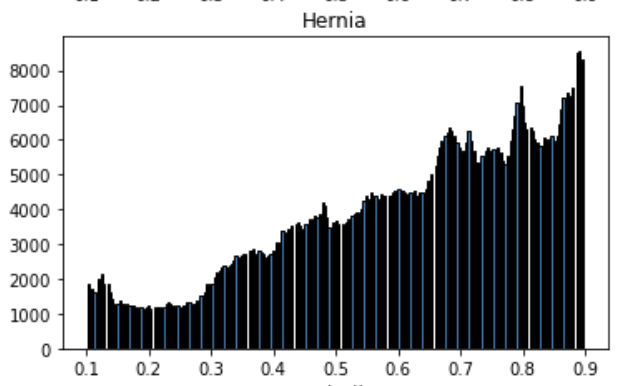

**Hardware Requirements:**

The algorithm was tested on Intel(R) i5-8259U @ 2.3GHz CPU:

* Average image processing time: 25 ms, max 102 ms
* Average CNN inference time: 512 ms, max: 624 ms

Any computer with similar or higher CPU is recommended.

**Clinical Impact of Performance:**

In terms of predictive value, model predicts negative with ~ 89 % probability and predicts positive with ~ 29% probability.
Therefore algorithm is recommended for assisting a radiologist screening for images that does not contain pneumonia, to priortize his/her time and attention
to those which potentially do.

It is also worth mentioning that when algorithm predicts negative is can still be wrong with ~11 % probability. So, those cases predicted negative should still be reviewed by the radiologist.

### 2. Algorithm Design and Function

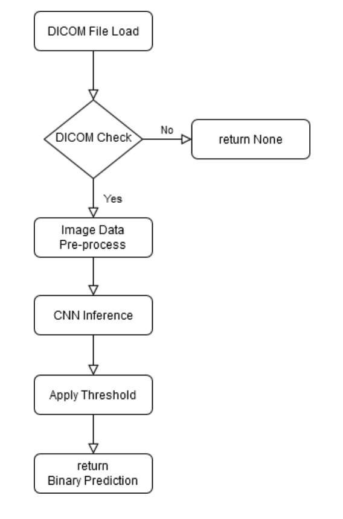

**DICOM checking steps:**

The algorithm performs the following steps - 

* Check the Patient age to be in between 2 and 90 (inclusive).
* Check examined body part is 'CHEST'.
* Check patient position to either 'PA' or 'AP'.
* Check modality is 'DX'.

**Pre-processing Steps:**

The algorithm performs the following steps on image data -
* Converts RGB to grayscale.
* Resizes image to be 224*224
* Normalises the internsity to be between 0 and 1.

**CNN Architecture:**

The model has a pretrained VGG-16 model (except the last blockof Convolution + pooling layer), with additional 4 Dense and 3 Dropout layers. 

The network output is a single probability value for binary classification.

Below is the CNN architecture graph:

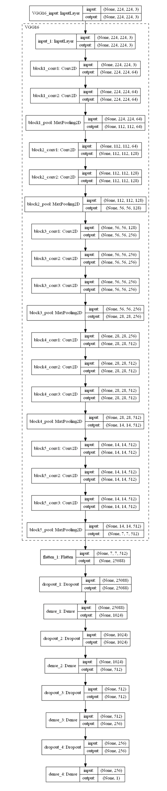

### 3. Algorithm Training

**Parameters:**
* Types of augmentation used during training
    * horizontal flip
    * height shift: 0.1
    * width shift: 0.1
    * rotation angle range: 0 to 20 degrees
    * shear: 0.1
    * zoom: 0.1
* Batch size: 100
* Optimizer learning rate: 1e-5
* Layers of pre-existing architecture that were frozen
    * All except last convolution + pooling block
* Layers of pre-existing architecture that were fine-tuned
    * The last 2 layers of VGG16 network: block5_conv3 + block5_pool
* Layers added to pre-existing architecture

    * 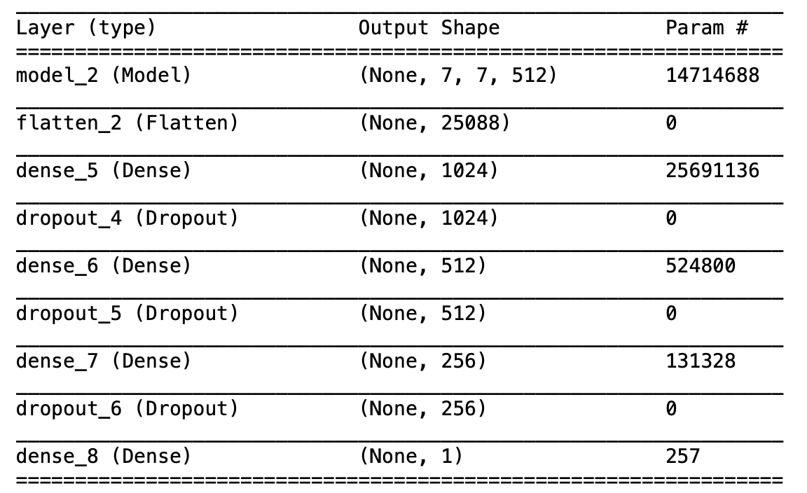

#### Algorithm training performance visualization

Early stopping with patience of 10 epochs was used to stop the learning process. The behaviour of the validation loss during training may indicate a possibility that
a lower learning rate could produce better results. This is left for future research.

#### Model performance metrics depending on threshold

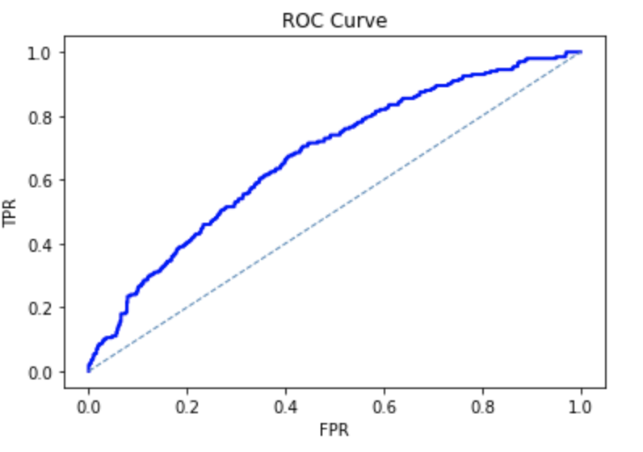
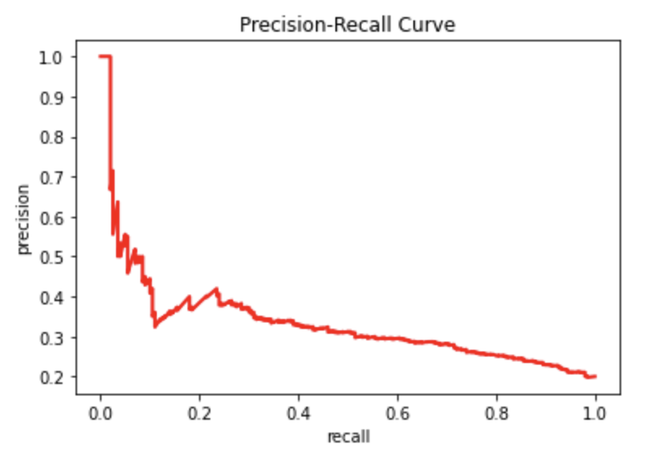

ROC curve is not particularly not impressive but does shows that model has indeed learned something from the data.

Also, we can see that model has low precision, but higher recall.
 
**Final Threshold and Explanation:**

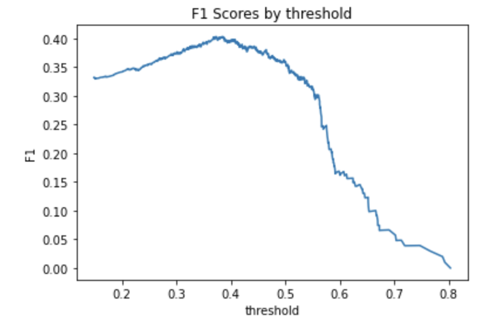

The maximum F1 score for the model is 0.40 and it is achieved with threshold value of 0.43. Below is the comparison of F1 score with those given in 
[CheXNet: Radiologist-Level Pneumonia Detection on Chest X-Rayswith Deep Learning](
https://arxiv.org/pdf/1711.05225.pdf):

| Person or Device | F1    | 95% CI 2sigma| 68% CI 1sigma|
|------------------|-------|--------------|--------------|
| Radiologist 1    | 0.383 |(0.309, 0.453)|(0.345, 0.417)|
| Radiologist 2    | 0.356 |(0.282, 0.428)|(0.319, 0.392)|
| Radiologist 3    | 0.365 |(0.291, 0.435)|(0.327, 0.399)|
| Radiologist 4    | 0.442 |(0.390, 0.492)|(0.416, 0.467)|
| Radiologist Avg. | 0.387 |(0.330, 0.442)|(0.358, 0.414)|
| CheXNet          | 0.435 |(0.387, 0.481)|(0.411, 0.458)|
| X-PDT Max F1     | 0.400 |              |              |

We do not calculate here the models 95% confidence interval for simplicity, 
and compare models statistical significance by assuming normal distribution 
and simply comparing the models F1 score to 1-sigma CIs calculated from 2-sigma ones. 
This model's score is higher and outside of 68% (1-sigma) CI for 
two radiologists out of four, which points to 'some statistical significance' of the given model.

Comparing the F1 scores themselves, this model achieves higher 
maximum F1 score than an average radiologist 
in the study. State of the art neural network, as well as one radiologist from the study,
do achieve higher F1 score, but the model's performance is comparable and in many cases 
exceeds the performance of human radiologists (in terms of F1 score).

Furthermore, since the model does not have a high precision with any meaningful recall value,
its usefulness tends to lie in its recall (and negative predictive value).

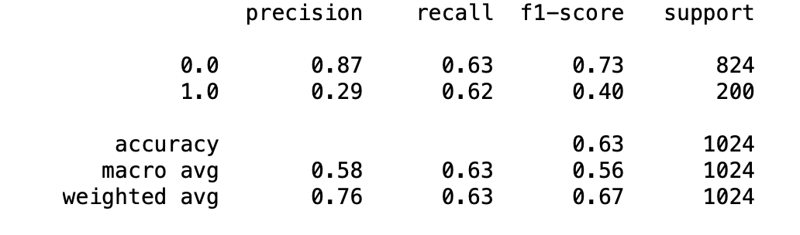

### 4. Databases

**Description of Training Dataset:** 

Training dataset consisted of 2290 chest xray images, with a 50/50 split between positive and negative cases. 

Example Images: 

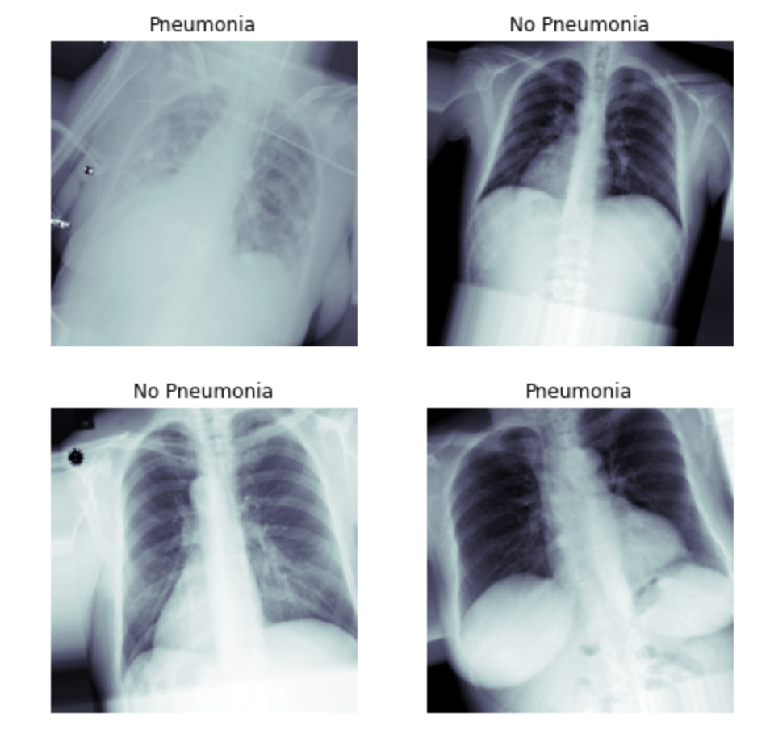

**Description of Validation Dataset:** 

Validation dataset consisted of 1430 chest xray images, with 20/80 split between positive and negative cases, which more reflects the occurence of pneumonia in the real world.

### 5. Ground Truth

The data is taken from a larger xray 
[dataset](https://www.kaggle.com/nih-chest-xrays/data), with disease labels 
created using Natural Language Processing (NLP) mining the associated 
radiological reports. The labels include 14 common thoracic pathologies 
(Pneumonia being one of them): 
- Atelectasis 
- Consolidation
- Infiltration
- Pneumothorax
- Edema
- Emphysema
- Fibrosis
- Effusion
- Pneumonia
- Pleural thickening
- Cardiomegaly
- Nodule
- Mass
- Hernia 

The biggest limitation of this dataset is that image labels were NLP-extracted so there 
could be some erroneous labels but the NLP labeling accuracy is estimated to be >90%.

The original radiology reports are not publicly available but more details 
on the labeling process can be found [here](https://arxiv.org/abs/1705.02315). 

### 6. FDA Validation Plan

**Patient Population Description for FDA Validation Dataset:**

The following population subset is to be used for the FDA Validation Dataset:
* Both men and women 
* Age 2 to 90 
* Without known comorbid thoracic pathologies listed above

**Ground Truth Acquisition Methodology:**

The golden standard for obtaining ground truth would be to perform 
one of these tests (see this [Mayo Clinic Link](https://www.mayoclinic.org/diseases-conditions/pneumonia/diagnosis-treatment/drc-20354210)):
* Sputum test
* Pleural fluid culture

Yet, these tests are quite expensive, and in most cases diagnosis is 
concluded by the physician based on radiologist's analysis/description.
Since the purpose of this device is assisting the radiologist (not replacing him/her),
the ground truth for the FDA Validation Dataset can be obtained as an average 
of three practicing radiologists (as a widely used 'silver standard').
The same method is used in the mentioned paper. 

**Algorithm Performance Standard:**

In terms of Clinical performance, the algorithm's performance can be
measured by calculating F1 score against 'silver standard' ground truth as described above. 
The algorithm's F1 score should exceed **0.387** which is an average F1 score taken over
three human radiologists, as given in [CheXNet: Radiologist-Level Pneumonia Detection on Chest X-Rayswith Deep Learning](
https://arxiv.org/pdf/1711.05225.pdf), where a similar method is used
to compare device's F1 score to average F1 score over three radiologists.
